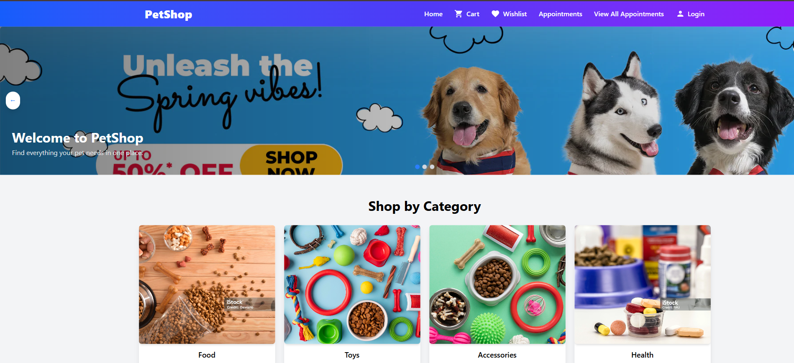

# 🐾 PetShop – eCommerce Pet Shop

A modern full-stack web application for pet lovers to shop pet products and book veterinary appointments. Built using **React**, **Node.js**, and **MongoDB**, PetPals offers a seamless user experience with secure authentication, a dynamic cart system, product browsing, and appointment scheduling for pets.

---

## 👨‍💻 Developed By

- **Aditya Lakshman Mapari**  
- **Nikhil Dattatraya Kamthe**  
*Fergusson College*

---

## 📸 Screenshot





## 🚀 Features

- 🛒 Add to Cart & Checkout
- 🐕 Product Categories (Food, Toys, Accessories)
- 🔐 User Authentication (JWT-based)
- 🩺 Book Doctor Appointments
- 📜 Order History for Users
- 🎨 Responsive UI with Tailwind CSS

---

## 🛠 Tech Stack

**Frontend**
- React.js + Vite
- Tailwind CSS
- React Router
- Axios

**Backend**
- Node.js
- Express.js
- MongoDB + Mongoose
- JWT (Authentication)

---

## 🧪 Getting Started

### 📦 Prerequisites

- Node.js v14 or later
- npm or yarn
- MongoDB (local or Atlas)

---

### 🔧 Installation

```bash
# 1. Clone the repository
git clone <your-repo-url>
cd pet-shop

# 2. Install backend dependencies
cd server
npm install

# 3. Set up backend environment variables
# Create a .env file inside /server and add:
MONGO_URI=your_mongodb_connection_string
JWT_SECRET=your_jwt_secret

# 4. Start the backend server
npm run dev

# 5. Install frontend dependencies
cd ../client
npm install

# 6. Start the frontend
npm run dev
